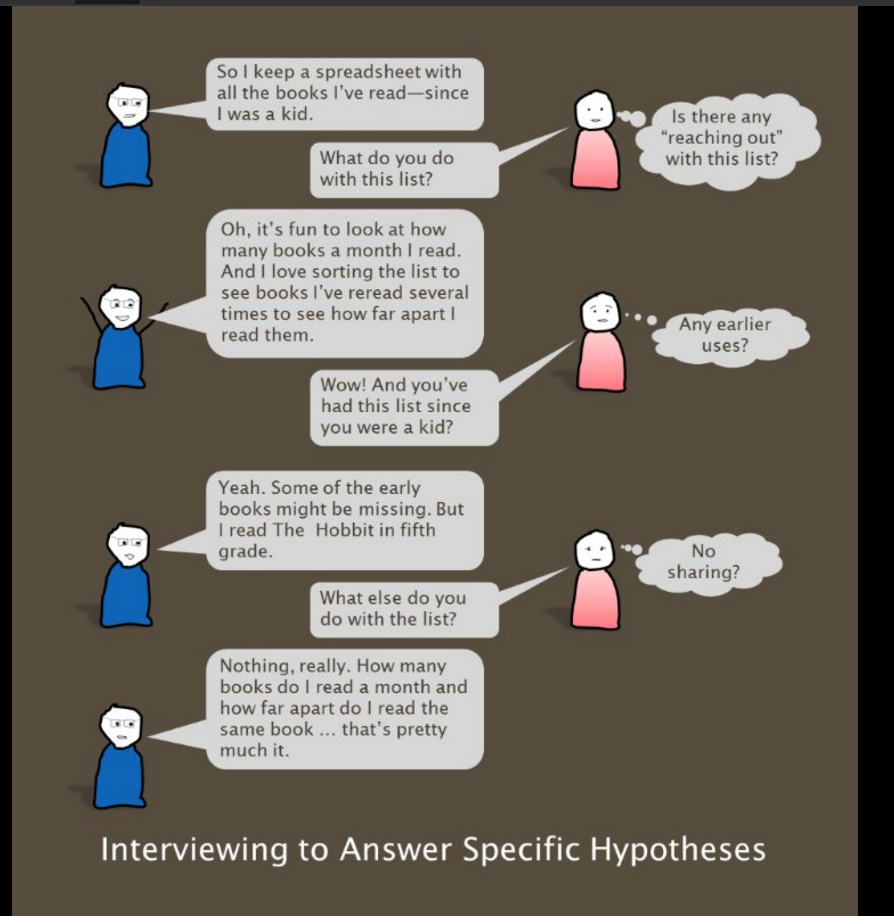

Conducting an interview is difficult precisely because it seems so easy. You're just talking to someone! What could be hard about that?! It's true that interviews follow many of the conventions of regular conversation, but they are subtly different in tone and purpose.

In regular conversation, the purpose is social as well as epistemological. We are sharing information, but we are also forming a bond. To do this, we all use imperceptible speech patterns, body language, and social cues to help the conversation go smoothly and establish a good rapport. We agree with someone else's phrasing even if we would have put it a slightly different way. We finish each other's sentences as a way of signaling understanding. We nod and smile to signal that we agree. These techniques are great for building a social bond but can get in the way when conducting an interview.

Unlike a conversation, an interview is not a two-way equal exchange, and herein lies the difficulty. As the interviewer, you need to rely on social norms to make participants feel comfortable, but you also have to make sure that your subtle use of linguistic and social conventions doesn't imperceptibly encourage the participant to phrase something differently or agree with something just to build that bond. You need to ask questions in a way that encourages openness but then get out of the way while the participant gives their answer.

 

####Tips for Conducting Interviews

- Before the interview, do a cleansing brain dump of all the things you might expect to see and hear. This process will help you be open to what you are seeing, hearing, and learning
- Cultivate curiosity and resist fixating on what you expect to learn. The more you are able to recognize and set aside your assumptions, the more you will be able to actually hear what people are telling you
- If possible, conduct interviews in your users' environment
- Create a welcoming atmosphere. Offer water, and explain how the interview will work
- Don't cut off the participant, even if it's to agree with what they are saying. Wait for an extra beat after they are done speaking in case they have something to add.
- Remain neutral; don't correct the participant or demonstrate your own beliefs or perspective
- Don't be afraid to stray from the interview questions; ask follow up questions that aren't on your script
- When asking a participant to list something, always follow up with "what else?" to make sure you get a complete answer
- Ask the participant about their emotional cues (e.g. "Why did you just laugh when you mentioned material design?")
- If the participant uses jargon, ask them what they mean (even if you think you know)

####Tips for Writing Interview Questions

- Focus on a small set of immediate hypotheses
- Use open-ended questions
- Use different question types to elicit information (questions about sequence, questions about quantity, etc.)
- Ask for specific examples (e.g., ask someone about the last two times they did an activity)
- Ask about exceptions and edge cases
- Ask about relationships and organizational structures
- Use the phrasing “Some people think X, while others think Y. What do you think?"
- Ask about others (do your colleagues also do it that way?)
- Ask them to walk you through a behavior
- Ask them to describe how a behavior has changed over time
- Avoid leading questions and closed yes/no questions.

