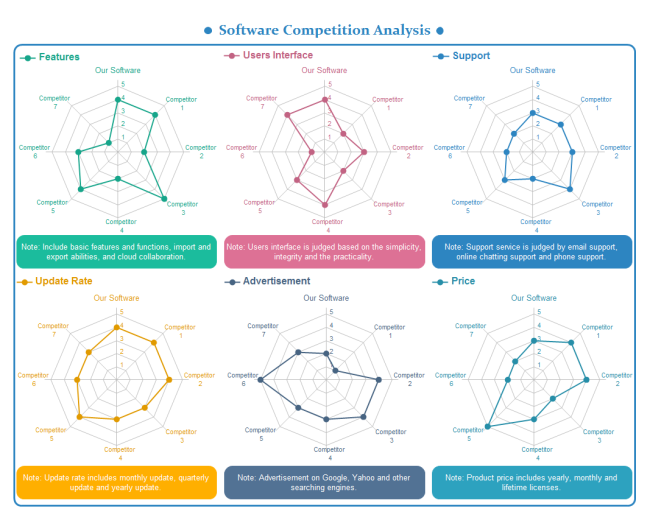

##What is competitor research?
<h4 class="description">Find out what others are doing.</h4>

Competitor research helps a client understand their competitive landscape by collecting data on other products that occupy the same market space, or that are competing for the same users.

By itself, competitor research will not tell you what you should design, or what your business strategy should be, it will only tell you what others happen to be doing. If it isn’t combined with user interviews or contextual inquiry, competitor research won’t tell you how users are actually interacting with products in the market.

####Why do we do it?
The objective of competitor research is to help the client and the designers understand the client’s competitors, and their existing solutions. From a business perspective, competitor research helps clients understand how they will need to position their own product so that it fits into the current marketplace.

From a design perspective, competitor research furnishes designers with inspiration and information on design patterns that are common among competitors, and demonstrates how others are solving problems in innovative ways. The data collected from competitor research may also be used by a product strategist when creating a product roadmap.

####How do I get started?

*Use these questions to help guide your work:*

- What space does my product occupy and who else is in this space?
- What solutions are others using to solve similar design challenges to the ones I am facing?
- What are my competitors’ strengths and weaknesses?
- What business strategies are my competitors using?
- What design patterns are my competitors using?
- How are my competitors establishing brand identities?
- Which users are competitors targeting?

Step 1: Make a list of the competitors. This step will ideally be created in collaboration with the client—sometimes they’ll want competitors just within their category/vertical, and other times they’ll want to go beyond that because they think the vertical is behind the times, and they’ll want to aim for best in class for their ultimate business goal.

Step 2: Identify categories. Make a list of the categories you would like to evaluate (business strategy, technology, back office integration, etc.). In most cases, the categories for evaluation will be determined in conjunction with the client, either through stakeholder interviews, a workshop, or other discovery activities and research. Categories should reflect the research themes that come out of discovery activities.

Step 3: Create a Google doc, spreadsheet, or Evernote notebook to capture notes and screenshots. Whichever tool you use, the important thing is that there is a consistent structure to the note taking.

Step 4: Desk Research
    - Start with Google, and begin filling in data and capturing screenshots of competitor products
    - Go beyond Google to YouTube, Instagram, Snapchat, etc.
    - Check Yelp or App Store for customer reviews
    - Look for relevant news items about competitors (you can set a Google Alert, or Yahoo Finance is often a good place to start)
    - Check the app store and try to download the product (if applicable)
    - Sign up for free trials to use competitor products or sites

Step 5: Beyond Desk Research. Find people who are using the competitors, and ask them about it. Call marketing representatives and ask for information or demos.

Step 6: Analyze Data
    - Report strengths and weaknesses for each product
    - Report key findings for each product
    - Report themes across products

####After you finish

You may want to review with your team to agree on what you think the strengths/weaknesses of the product you are reviewing. This will help to shape the narrative of your presentation.

The structure of a competitor research presentation will depend on the results of your analysis, but all presentations should, at minimum, contain the following elements:

- Approach — explain the methodology and criteria used for selecting and rating sites
- Findings — depending on the number of sites reviewed, perhaps start with high level findings, followed by individual findings that go through each competitor one by one
- Recommendations — explain how to apply findings to meet the client's business goals
