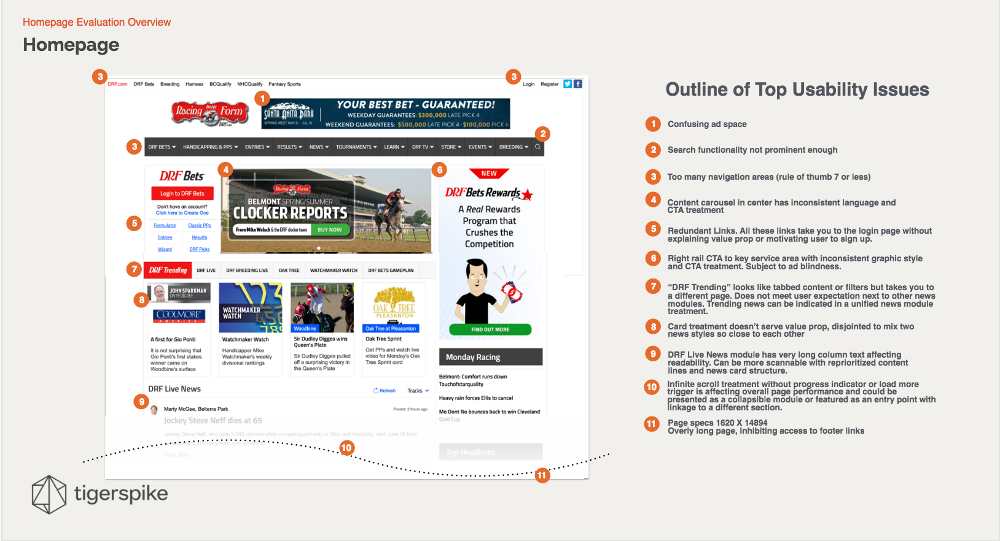

<a name="technique">

###What is the technique?

A design audit evaluates a product using broad categories and guidelines to structure the evaluation. Though the design audit is similar to what many in the UX community refer to as a "heuristic review," the Tigerspike version of the design audit does not seek to quantify the evaluation, nor does it necessarily seek to log every single usability issue existent on the site.

<a name="objective">

###What is the objective?

A design audit is often used to help sell design services to clients, or to demonstrate to clients how their product would benefit from improved design. The three primary objectives are to demonstrate Tigerspike's expertise, to show clients specific areas where their product is failing and needs improvement, and to give clients a better sense of how our work could improve their product. When appropriate, the design audit provides a client with best practices and recommendations or “opportunities" to guide future work.

<a name="begin">

###How do I begin?

Decide if you will structure the audit around specific tasks or pages, or if you will audit the entire site.

<a name="process">

###Tigerspike Process:

Step 1: Familiarize yourself with the product, as well as the pages and/or tasks to be audited.

Step 2: Familiarize yourself with the categories for evaluation.

Categories for Evaluation:

  - Home Page
  - Task Orientation
  - Navigation & IA
  - Forms & Data Entry
  - Trust & Credibility
  - Writing & Content
  - Page Layout & Visual Design
  - Search
  - Help, Feedback, Error Tolerance
  - Compliance with iOS/Android standards
  - Steps in the conversion process (for example, the full checkout experience)

Step 3: Go through each task or page, and note the strengths and weaknesses, making sure to cover all of the categories for evaluation, as well as relevant design guidelines for native apps.

###After you finish:

This step will depend on the client needs, but at minimum the output should include annotated screen shots of the product under review, as well as recommendations, opportunities, or next steps. In many cases, it will also be appropriate to include best practices research, potentially including real-word examples of them in use, with citations documenting the principles that guide good design.
