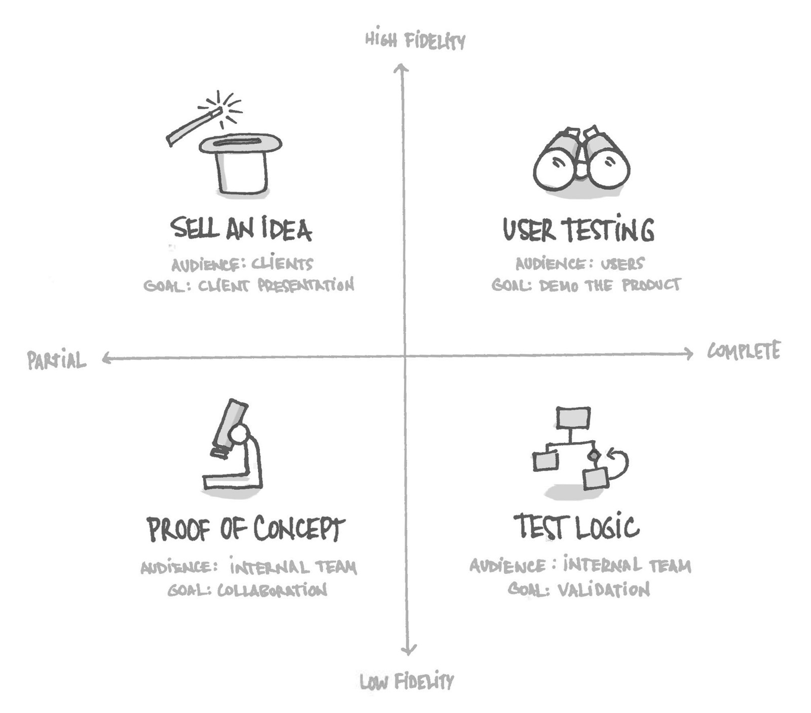

##What is a Prototype?
<h4 class="description">Demonstrates how a product could work.</h4>

A prototype is a very broad term that can encompass a wide range of outputs. On one end it could simply be a series of sketches taped or stacked together, on the other a fully coded out and interactive product that may pull in live data. Here is a over-simplified list of some prototypes:

  **1) Paper Prototypes** - lowest possible fidelity of prototype. Good to internally validate an idea or approach

  **2) Low Resolution Click Through Prototype** - a series of screens put together in an application such as Invision. Low resolution means that the design is not polished and is either hand drawn or wireframed

   **3) High Resolution Click Through Prototype** - same as above, but with more highly polished designs (comps) and at least some hints at interactions and transitions

  **4) Coded Prototype** - A prototype built in code should have decently high resolution and as much interaction as deemed necessary to communicate the idea.

####Why do we do it?

Developing a product that requires interaction is expensive and risky — we humans can be an unpredictable bunch. Prototypes help us test ideas and solutions without the full expense of development.

Maybe when you ask someone if they would use a product that does x, y, and z, they say “you bet I would!”. Maybe you even design a few mockups that everyone agrees looks great. But the simple act of stitching them together in a logical flow in a prototype will force some hard questions. Can the business even do this? Does the business want to do this? Is the user interested? Answering some of these questions before the design phase even starts could be helpful.

You can “test” your solution on the client by placing your designs into Invision and walking through a basic flow. This ensures that they are looking at the design in a context much closer to real life than a pdf or jpeg. Prototypes can be a great way to test solutions internally as well. A brainstorming or sketching session might lead to many ideas, but putting a few into a low-medium fidelity prototype can be a great way of figuring out which idea is strongest.

Prototypes are also helpful for testing solutions with users. Generally (though not exclusively), prototypes tested with users should be of a relatively high resolution and fidelity, looking as close to a finished product as possible. Even if using a click-through tool like Invision, care should be taken to make sure designs are polished and click events accurately placed.

Getting user feedback from a prototype is helpful on many levels:

- Validate the general approach - do users have a basic understanding of what they should be doing and why
- Validate more specific design decisions - do users understand how to perform key actions? Are they finding the UI elements they need to?
- Gauge emotional responses - trickier to measure, but finding out how they react to the design can be helpful. Do they like the big video? Do they find the big picture annoying? Etc.
- Elicit feedback - maybe they have specific ideas relevant to the content organization that your client or peers do not have. Information you thought of low priority may turn out to be of high importance to your actual user base.

####How do I get started?

Prototypes are best at working through solutions, so one should begin the creation of a prototype with an idea to test.

<b>Process:</b>
Because prototypes come in all different shapes and sizes, there are many different processes that can be attached to them. Below, are some general directions related to the kinds of prototypes previously mentioned.

#####Paper Prototypes

Even though these are hand-drawn sketches, they should be as neat and organized as possible. Sometimes starting in pencil and filling in with a thicker pen or marker is a good way to go. Sharpies are your best friend here. There are endless possibilities on turning sketches into prototypes, but here’s one tried and true method:

- Sketch out any global elements (navbar, header, etc) using a nice thick marker on A4 paper
- Photocopy this paper a few times, essentially creating a template with a consistent frame
- Pencil in the primary UI elements on your freshly minted templates
- Use thick (or thick and thin) markers to outline the marks you’ve decided on
- Take pictures of your lovely screens
- Upload to your computer
- Create a project in Invision, load the pictures, and create the hotspots

#####Low Res & High Res click-through prototypes

Low and high resolution prototypes are essentially created the same way, but with a different level of detail. Low resolution ones should not contain color, photographs, illustrations, or interactions outside of what is necessary to communicate a concept. Conversely, high resolution prototypes should contain as much detail as possible, including interactions, transitions, empty and error states, hover states, etc.

Our preferred tools change periodically, but we generally create these prototypes with the following process:

- Create screens in Sketch and give each artboard a unique and descriptive name
- Create a project in Invision and assign it the correct device
- Export artboards as pngs. If you want to use retina images, export them at 2x, with the @2x suffix
- If you use Invision sync, you can export the images directly into the Assets > Screens folder for that project. Alternatively, you can drag the images into the web interface
- Once uploaded, you can create hotspots as usual
- If you need to replace an image you can replace the file with a new one of the same name in the Screens folder, or drag and drop it onto that screen in the web interface
- To delete a screen, you must delete it using the web interface (not the folder)

#####Coded Prototype

On some projects, we may choose to create a coded prototype. These can be helpful because they bring development concerns to the front, and force us to make the simplest solution as fast as possible. When the goal is an MVP, testing is essential, and if the resources allow for it, it can be a great way to push many development risks forward. With high enough resolution, it can also serve as the primary design delivery for a project, effectively communicating core styles, components, colors, grid, etc.

There are many ways this can be executed, but here is an example process from a 1-2 week sprint:

- Define problem and content as early as possible, preferably by sprint planning
- XD team to conduct both group and individual sketching sessions, consulting with the tech team as much as possible
- Team to choose 1 or 2 approaches, verify with tech, and then verify with client
- When approach is confirmed, see if tech can start on basic structure, while high resolution UI is created as quickly as possible
- As soon as ready, upload UI to Zeplin, create appropriate tags, and get feedback from the team. Comments on Zeplin can be used to explain some details, ask questions, or provide feedback
- Care should be taken to maintain a basic style guide that includes type, color, and basic elements like buttons and inputs. The designer shouldn’t feel completely constrained to the guide, but should be aware of it’s adaptation over time

#####Interaction Examples

Sometimes, we may choose to showcase an interaction using tools like After Effects or Keynote. These tools allow for a high resolution view of more complicated interactions or animations that are unachievable in tools like Invision, and time consuming in code. However, they are not prototypes, per se, as they have only limited capacity to be shared and used outside of the design team.

Keynote is one of our favorite tools to quickly and easily build an interaction example. The steps are longwinded for this article, but <a href= "https://www.smashingmagazine.com/2015/08/animating-in-keynote/">here</a> is one example from Smashing Magazine, and <a href= "https://drive.google.com/a/tigerspike.com/file/d/0B9JF7o98Q7eUUmh2cnJJWk9keVU/view?usp=sharing">another one</a> from one of our team members.

####After you finish:

With the many different ways prototypes may be used, each will necessitate a different level of fidelity and resolution.

- Internal showcases - low-res and low-fidelity may be acceptable to go over ideas
- Client showcases - high-res is generally better, as clients may be hung up on boxy wireframes. Level of fidelity may vary depending on where in the process you are. If still in early Proof of Concept stages, low fidelity is acceptable. If you are deep in the project, consider making the prototype relatively high fidelity.
- User testing - generally needs to be both high-resolution and high-fidelity. Otherwise you create barriers between the user and their concept of the prototype as an actual product
- Design delivery - high-res and as high-fidelity as possible, though documenting where the prototype and actual functional behavior differ is important

Prepare your presentations and work accordingly.
