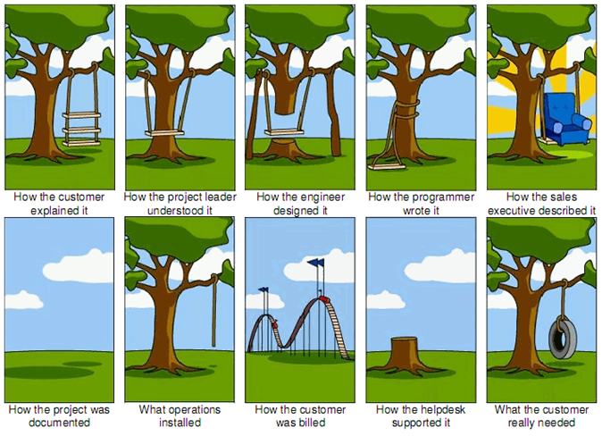

##What is Requirements Definition?
<h4 class="description">Account for on the planning, creation, delivery, and governance of content.</h4>

Requirements are a documented functional need that a particular product, service or process must be able to perform. Typically they are presented as statement that identifies a ‘required’ attribute, capability or quality of a system for it to have value and utility to a customer, business, internal user or other stakeholder.

Requirements are not the solution, they are expression of value to user.

Ideally, requirements emerge after the primary user and business needs and product vision have been defined as part of the Discovery phase. The requirements are the bridge between this higher level thinking and the execution of a software development process.

User stories are combined of three parts: the user, what it is they want to achieve, and why they want to achieve it.

Acceptance criteria are things you have to do in order to meet the requirement (these should be pass or fail).

Requirements definition can help to answer the following questions:

- What is the problem to be solved?
- What do users want to accomplish?
- What are the criteria for success?
- What are the known technological and business drivers and constraints?
- What is in-scope and out-of-scope?

####Why do we do it?
Requirements definition and validation is a key step in leading a project to a successful conclusion. It allows stakeholders to transparently agree to exactly what a project will entail. Throughout the course of the project, new ideas or tangents naturally arise. Having the requirements provides a “north star” that keeps us on course. It also creates a framework for us to discuss and consider key changes that may arise. In essence, requirements ensure that we complete what we have set out to do.

####How do I get started?
Creation of the Requirements document can happen in collaboration with the client through a <a href="/tools/story-mapping.html" title="Story Mapping">Story Mapping</a> exercise, or Tigerspike can write them internally. Once defined, Project Manager should assume ownership/maintenance of this document.

A requirements document describes the following:

- functional requirements and/or epics specific to design
- the type of user this functionality applies to (e.g. end user, admin)
- a list of assumptions that must be validated or invalidated through research and testing
- priority for said requirement (e.g. MVP, backlog, not recommended)

Tigerspike will typically suggest priorities based on our research, but these will then need to be validated in a group session involving as many stakeholders as possible. During this group session, changes are made live, directly in the Google Spreadsheet.

Other notable things to capture:

- who owns and updates each page or any applicable element
- when was it added to the list either initially or when added/changed (adding a date)
- what metadata is associated for a page or applicable element

####After you finish:

Once the requirements are written and validated and the project begins, they will either be tracked against design/dev within the same document, or they will be entered into a software management system, such as JIRA, for a development and design team to work from. A process is discussed with the client upfront for how to address suggested changes that come in throughout the project. However, it should be clear that once the requirements are validated, any changes to them will need to go through a process to be implemented, and doing so may entail a de-prioritization of other requirements to finish the project on time and on budget.
