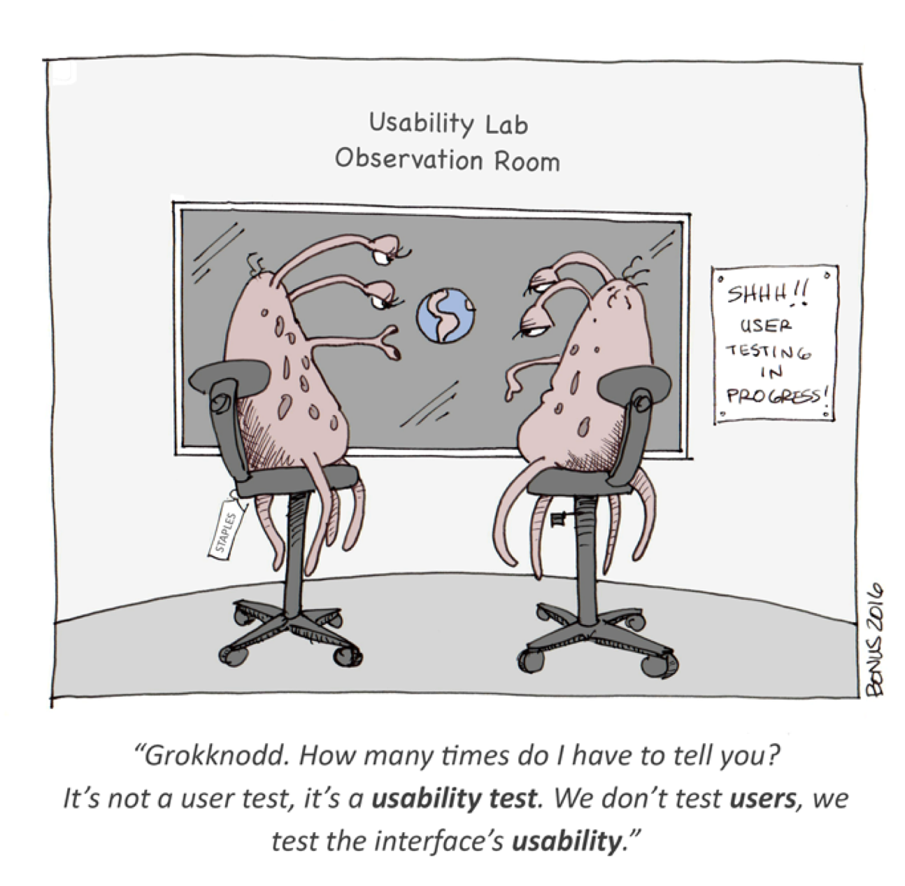

##What is Usability Testing?
<h4 class="description">Test how a product works using realistic user scenarios.</h4>

Usability testing is the process of observing real people as they interact with a prototype or design. While the process can range from formal lab testing with a fully developed product to guerrilla field testing with paper prototypes, any time you observe and analyze a user navigating your design, it counts as usability testing.  

####Why do we do it?
The design process is based on (sometimes incorrect) assumptions, and usability testing is a great way to validate those assumptions, as well as to identify any pain points that users have when completing key tasks and interactions. Testing allows designers to evaluate the viability, placement, interpreted meaning, and functionality of a design’s key elements. Additionally, usability testing helps clients and designers see the design through a user’s eyes, and gives users a chance to contribute their own perspective.

####How do I get started?
Coordinate with a project manager and begin recruiting participants as soon as possible; it will take longer than you think to schedule and confirm the sessions. You should also begin thinking about what kind of recording equipment you will need, and how the logistics of the test will work (will the user bring their own device or will you supply one? Will you be filming the sessions? Voice recording?) Finally, make sure you have a clear idea of the objective(s) of the test. What specific hypotheses are you testing?

Step 1: Develop a research plan that communicates the objective of the test, the hypotheses you are testing, where the test will take place, who will participate, and how you will be tracking behavior

Step 2: Make a list of the specific tasks or scenarios you will be testing

Step 3: Find and screen participants

Step 4: Write the Usability Test Script (see Tigerspike examples)

Step 5: Conduct the test sessions (roughly 45 minutes each)

Step 6: Debrief with team. If time allows, take 5-15 minutes after each test for each team member to write down on post-its what you heard, learned, and observed. Save these post-its for the analysis.

Step 7: Analyze Data

####After you finish:
When the testing is complete, share information with designers about how well users were able to navigate the design. Report how many users were successful, and how many got stuck or were unable to complete a task. Report specific features or screens that confused users. For clients, a Usability Testing Report should include the following sections: why we tested, what we tested, how we tested, observations & recommendations for each task (including quotes and relevant anecdotes), and next steps. If you are proposing a number of design fixes, it is important to prioritize so designers know where to begin.

Involve as many team members as possible. Ideally, every team member (not just designers) will have an opportunity to observe at least once session. Consider setting up an internal session to play recordings for the team to review.
