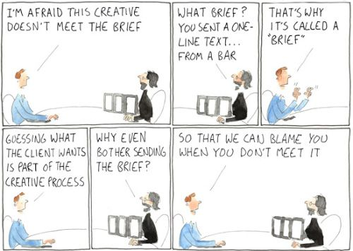

<!-- ###Tigerspike's USP

Visual Language Briefs increase clarity in visual discussions with clients. They improve the quality of client feedback, and to reduce risk on visual projects caused by not having established terms used to describe visual design.

High quality visual and motion interaction design greatly increases usability and product performance. Without it there would likely be multiple attempts made in an iterative way that attempt to solve visual asks. Time would be wasted, efficiency decreased, and profitability per project lost. For the creative team it’s also extremely helpful to know what needs to be designed prior to designing it, and have the context of initial conversations with clients and stakeholders on their needs/vision, and point of view. On a granular level, the language that clients use can often be worked into the design outputs to make sure they’re understanding the terminology in language that they’re comfortable with. Some clients prefer official or technical language as means of processing the information while others prefer more casual language. -->

<a name="technique">

##What is a Visual Language Brief?
<h4 class="description">Define a product's visual parameters and requirements.</h4>

A design brief is a tool for discussing visual language with clients, and establishing the parameters of the visual aspects of the design in a way that can then be applied to the visualized product design. They are used to gather and document information, elicit client feedback, increase stakeholder buy-in, understand visual requirements, and asset resources prior to creative teams beginning work on visual creative (icons, interface design, etc).

The creative brief is used during the Define phase in collaboration with stakeholders as a way of aligning resources and expectations. Bear in mind: The creative brief is not your product brief. It doesn’t have to establish the product goals or product strategy, and should be done once a series of discovery activities have already identified and prioritized user stories, user tasks and goals, information architecture, and content priority are are already in place.

####Why do we do it?

The objectives are:

- To create a shared understanding of terms and a visual product direction in partnership with client stakeholders (e.g. Layout, Prominence, Legibility, Scale, Color, Photography, Iconography, Typography, Device Considerations, Interactions, Motion, Cadence, Transitions, etc.)
- Bridge the gap between visual language and verbal communication.
- They provide an opportunity to identify any visual requirements or existing assets that should be included in the design process, such as logos, color specifications, and any branded assets that should be used or considered, or that should not be used/considered.
- Identify stakeholders that need to sign off on work. (Outside of product teams there are often brand stakeholders or marketing stakeholders that may need to see the creative).
- Establish an understanding of visual affinity and context.

Creative briefs are a way of mitigating risk when beginning creative processes. They increase the effectiveness of visual and verbal communication, help creative teams understand client expectations, and galvanize and align stakeholder teams from early on in the product development life-cycle. They often accompany mood boards or style tiles as the interpretation and documentation of a visual process.

####How do I get started?

Gather visual materials that are existing already from the client. This includes:

  - Web collateral, and what’s been published online
  - Press relations materials
  - Investor relations materials. You can usually get good information from the visuals that are used to sell the company both to prospective consumers and to investors.

Review primary competitor’s platforms and collect screenshots from the 3-5 most prominent competitors in the field. The client will likely reference these materials in their casual conversation, and you will need to know that they’re referring to.

The process for creating a brief is different depending on the audience — whether client or the internal team.

<b>Process 1</b>: Client-oriented Brief

The primary function of the brief is for client alignment and product direction.

- Scope: Aggregate scope / visual requirements that may have come from the discovery phase from the roadmap or prioritized requirements document. This can include things like product screens, logo, data visualizations, etc.
- Visual Requirements: Each description needs to represent the visual requirements as they are stated either broadly or specifically. For example, "UI Design” is a broad requirement while “6 screens representing the primary user journey” is more specific and “Primary user flow across the device sizes with a Zeplin style guide” is even more specific. Remember — this is a steering document rather than an execution plan. The brief should be written in a way that can provide context and make clear the client needs/requests.
- Value Proposition/Brand Tenants: Because there are usually visual deliverables associated with the creation of the brief document such as a moodboard or style tile, they can typically be tied to the value proposition to the user or to the brand tenants depending on how much is already established from the client. For example, a client that is rebranding their web platform as the central piece of collateral will be a different level of visual ask than that separates product design from brand design, and engaged with a branding firm to create visualizations, photo styles, language, and multi-channel campaigns.
- Visualizations and Considerations: This can vary from project to project depending on the scope, complexity of the client side team, and the level of familiarity with visual terminology and its impact on usability. It may be important to do some client education here by providing insight into the connection between visualizations and product performance.  If you are using a <a href="" title="">moodboard</a> you will be referencing aspects of existing collateral in the public realm that include elements that will be similar to goals of the visualizations for the product creative. If you are using a <a href="" title="">style tile</a>, then the assets that you create will be applied to the product as defined in the scope and requirements and will be bespoke solutions to the client. Important categories to consider include:
    - Layout
    - Prominence
    - Legibility
    - Scale
    - Color
    - Photography
    - Iconography
    - Typography
    - Device Considerations
    - Usage
    - <a href="https://www.w3.org/WAI/WCAG2AA-Conformance" title="Level AA Conformance to Web Content Accessibility Guidelines 2.0">AA Compliance</a>
    - Interactions
    - Motion
    - Cadence
    - Transitions

<b>Process 2</b>: Team-oriented Brief

If you will not be the primary designer working on the product design, then in order to communicate with the team picking up the work, the document needs to achieve the following:

- Align terminology with the client expectations
- Outline visual language for the above categories
- Communicate both visual language and client needs to the creative team that will be creating the product design.

Because visual thinking can be more subjective than quantitative reasoning, it will make sense for Process 2 that you are very careful in documenting the work products and processes that are used in the creation of the moodboard/style tile, and that you can explain your reasoning and client feedback with some level of granularity to the working team. LAM is a good example of having a clear visual process that was pre-defined in the define phase that carried through into the design phase.

To a certain extent, the creative brief will be used to define the scope of the creative work that is done on the visual product design. Because of this, any change that is requested mid-way through the creation of the product visuals will need to be vetted through the account manager. There have been scenarios where we have accommodated client requests that are very different from the original brief (TLC is an example of this) and there have been cases where we have initiated a separate phase of work to accommodate a branding change (AMEX Eligibility Checker is an example of this).

####After you finish:

The brief will likely be part of a presentation of the visual asset associated with the brief in the form of a presentation. Ideally these would be written in as visual requirements, and tracked in the same way as product requirements. The brief should be referred to frequently as the design is being conducted, and will likely also be referenced during client touchpoints or design reviews.
