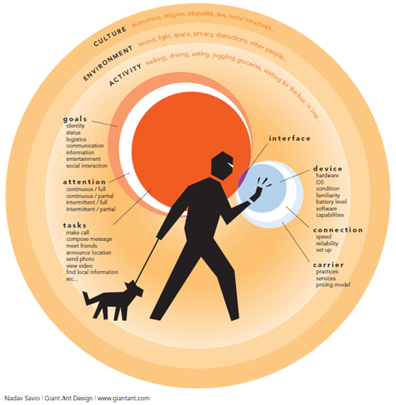

###What is Contextual inquiry?
<h4 class="description">Conduct fieldwork to understand the user's world.</h4>

Contextual inquiry is a user research method that helps us understand what people do and why they do it in the real world. It is used to investigate a user’s behavior and the intent behind actions or the sequence of routine tasks.

The true value of contextual inquiry is in actually going to the place where users are using the product or service. This could be an office, a home, a restaurant or even a fire engine. Users can <b>show</b> us what they do rather than tell us, and we better understand <b>why</b> they do it.

A contextual inquiry is a great way to answer the following questions:

- How do customers actually use products in real world situations?
- How does a product fit into a user's life or workflow: when, why, and how is it used?
- Is the customer using a product in an unintended way?
- What environment factors influence context of use?
- What are the goals and motivations for using a product or service?
- How do users think about their jobs and activities?
- What sources advance or inhibit efficiency and frustrations?

####Why do we do it?
The objective of contextual inquiry is to learn how people do things—how they complete their work, how they spend their time off, how they purchase things, or how they manage their finances. In contrast to data analytics, we can understand the intent behind users’ actions. In contrast to surveys, we can interact with users and understand what they are doing. In contrast to usability testing, we can observe users in their real environment, undertaking natural tasks.

Contextual inquiry is not the remedy to ineffective, substandard products and should be used in conjunction with other methods such as interviews, surveys, and diary studies, but it can be the missing ingredient to success. Use contextual inquiry iteratively during the development of products, systems or services to ensure that users understand your design intent

####How do I get started?

First, make a research plan that includes a timeline, recording techniques, indicative outputs, and the primary client contact for approval and sign off. Next, identify a focus. Think about what you hope to learn from observing and listening to people (can be general or specific), and what style of observation you will employ. Types of observation styles include Covert (secret agent style), Overt (researcher identifies themselves), and Participation (researchers take part in what they are observing).

When you are in the users’ environment, take as many notes as possible and try to observe as much as you can. Make sure you carry out the following:

- Learn about the users and their tasks
- Observe how users accomplish tasks
- Note how long it takes to complete common tasks
- Note the equipment they are working with
- Note how their space is set-up
- Pay attention to interruptions in the flow of work
- Observe the physical environment
- Observe the social environment
- Learn about users’ values, issues and preferences

Real people are essential to the success of contextual inquiry. As such, the relationship between the researcher and participant is critical and should be based on honesty, trust, and respect.

####After you finish:

When you're finished, identify the tasks carried out, and use affinity diagrams to group all related activities.

Use contextual inquiry iteratively during the development of products, systems or services to ensure that users understand your design intent
>>>>>>> c300b7522ce8ccd4de13df1b584bdbb70e011cb8
