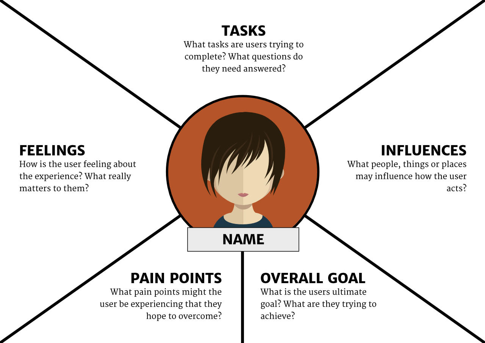

##What is empathy mapping?
<h4 class="description">Document a user's perspective.</h4>
Empathy maps are a visual brainstorming tool used to document a user’s perspective. They are created with a set of questions that hopefully start us on a journey of discovery, challenging us to consider how well we really know the people we serve. It’s a collaborative tool that teams can use to better understand their customers. They can be used whenever you find a need to immerse yourself in a users’ environment, and are especially helpful during workshops.

####Why do we do it?
Empathy maps help us to put ourselves in our users’ shoes and think about what challenges they have we could potentially solve and what goals they want to achieve. Taking this information we can use it to populate our Archetype/Persona document.

####How do I begin?

Step 1: Take a few sheets of paper and draw the diagram above; or if using the Empathy Map Template, grab a few. You’ll want to make a couple.

Step 2: Set a timer for 5 minutes. Sketch out as much detail as you can. Reset the timer and do a few more.

Step 3: Start by giving this customer a name and some demographic characteristics, such as income, marital status, and so forth

Step 4: Then, referring to the diagrams, use a flip-chart or whiteboard to build a composite profile for your newly-named customer.

Step 5: Try to create as many maps or variations of users as you think is valuable. You can refine and edit them later.

####After you finish:

Discuss these maps as a team. Ideally, you’ll refine them a bit during discussion and translate them to digital format for future reference. Don’t lose the benefits of the empathy mapping once the workshop ends. Turn the empathy maps into posters and post them up on the walls. This helps to ensure the user remains in people’s minds as they work. If sharing with clients, post the PDF version onto Basecamp or include your maps as part of a presentation.
