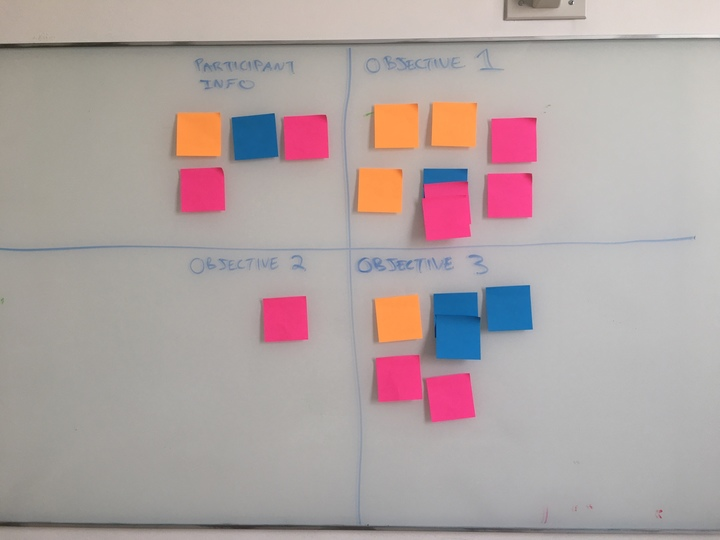

##What is an interview debrief?
<h4 class="description">Process learnings following a user interview.</h4>

The Interview Debrief is a tool to help you immediately process an interview right after it concludes.

####Why do we do it?

Often, research teams are conducting multiple interviews in a day, and don't have time between interviews to do a lengthy analysis. At the same time, it's important to synthesize learnings as they come in, and share them with the rest of the team as soon as possible.

####How do I get started?

Tigerspike has two different techniques for the interview debrief, so before you begin, you will need to decide which technique you will be using. Whichever technique you choose, preparation is key. The debrief happens quickly, and is often sandwiched between two interviews, so you need to prepare all of your supplies in advance, and make sure your team knows what to expect.

<b>TECHNIQUE #1: The Worksheet Method</b>

Every member of the Tigerspike interviewing team should have one copy of the <a href="https://docs.google.com/document/d/1w4Kdo2s3khF0eEfgpl3IPJ6f-LNDh_4flk75OES8htU/edit" title="Interview Debrief Worksheet">Interview Debrief Worksheet</a> for each participant you have scheduled that day. Make copies of the Worksheet in Drive and save the link somewhere where you can access it quickly (if you are using the User Interview Trello Board to manage research, that is a good place to store your links). For example, if you have three interviews scheduled and there will be two designers at each interview, then you will need to pre-save 6 copies of the worksheet altogether. Fill out the top of the worksheet in advance (date, project name, etc.), and put the name of the participant and the designers’ initials in the title (Example: Interview Debrief Workshop_Participant A_KW). Again, this is so that you can quickly find the right worksheet at the right time. Fill out the objectives of the interview in advance.

When the interview is over and the participant has left the room, set the timer for 20 minutes (roughly 3 minutes per question).

Each person fills out a worksheet. Make sure you spellcheck your work and write in a tone that can be shared with a wider audience. The worksheet is a work product, but the idea is that you could potentially share it with a client as part of a research update, so make sure your work is clean.

Make sure the link to the worksheet is saved to the User Interview Trello Board or another place where you can easily find it.

<b>TECHNIQUE #2: The Post-It Method</b>

Assign a color to each of the participants you have scheduled that day. Make sure you have sticky notes that match the colors you've selected. Prior to the interviews, you should also agree on three objectives or things you want to learn. Create a matrix on the whiteboard with one square for each objective. In the fourth square write, "participant info".

After the interview concludes and the participant leaves the room, set the timer for 7 minutes. Give each team member a stack of sticky notes that matches the assigned color of the participant. For 7 minutes, have each team member silently write down everything they heard and learned, including quotes, surprises, insights, facts, and questions (one thing per sticky note).

After the timer goes off, place the sticky notes on the white board in the appropriate quadrant. If the note doesn't fit in any quadrant, place it off to the side in a 'parking lot'. Repeat after each interview (with a different color for each participant). At the end of the day, you will be able to see how your research is mapping on to your objectives. If one or more of your objective quadrants is relatively empty, consider adjusting your interview script to better meet your objectives.

When all of the interviews are finished, schedule some time to process the findings (it's a good idea to schedule roughly 30 minutes per participant)
- In the User Interview Trello Board, create a column for each quadrant of the matrix
- Put the insights from the sticky notes into the Trello board, labeling them with the appropriate color (note: focus on patterns, or insights that appear in two or more colors)

####After you finish:

The debrief is meant to be a polished and self-contained research artifact that you can return to over the course of the project. It is particularly useful when onboarding new team members, or in later phases when you have to communicate the Discovery findings to the whole team. In some cases, you may want to share the interview debriefs with clients, if they are interested in having more details than are available in the report.
