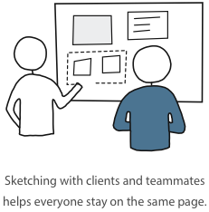

##What are sketches?
<h4 class="description">Draw a picture, tell a story.</h4>

Sketches are the lowest possible fidelity designs, useful for getting down many different ideas and approaches in a relatively short period of time. When working alone, and often with a group, the best format for sketches are on paper. While tools can be quite personal, our preference is to use pens and markers, not pencils. This forces you to commit to a mark on the page and move forward. Scribble, cross out, or start over as necessary, but sketching with a pencil and eraser can occasionally detract from the point of the exercise, which is the ideas, not the output.

#### Why do we do it?
Search around for any “design process” diagrams and you will find frequent references to divergences and convergences of ideas and implementations. Sketching is a great way to generate divergences, or many different branching ideas. There may be times when going straight into your graphics editor might make the most sense, but the risk is that you will commit to your first idea too quickly and become attached before you have the opportunity to explore. Who knows, you may learn new information along the path and realize that the current solution no longer fits, in which case having some other ideas sketched out might be quite useful.

####How do I get started?

Sketching should be the first step in translating ideas and concepts into designs. Sketching independently and as a group can serve similar but different purposes. Group sketching sessions can, and probably should, include time for independent sketching as well.

Sketching early in the product design process and later are both useful, and will serve slightly different purposes.

Earlier in the Product Lifecycle:
When earlier in the process, group sketching sessions can be a great way to produce many different ideas from different perspectives. There are many ways to conduct a group sketching session, but here’s a very basic process:

- Agree on basic problem definition
- Use a short time frame to create as many ideas as possible (10-15 minutes max)
- Present ideas to group (no more than 4-5 people)
- After hearing different ideas, choose one of your ideas, adapt as necessary, and sketch out in more detail (15-20 minutes max)
- Present ideas again, and take note of any feedback
- Output: a handful of different ideas that have all been thought out and presented

Later in the Product Lifecycle:
If later in the process, the problem should be much more defined, and we are now probably looking for more implementation oriented solutions. At this point the goal should be to generate different ways to solve a problem. These can then be shown to developers or possibly even stakeholders to verify that a proposed solution is viable.

Before starting any wire or comp, a designer should take time to sketch alone to work out a few possible approaches and layouts. The main goal here is to have a few solutions on paper before committing to them on the computer.

For very specific problems, designers may even sketch together on a whiteboard. These sessions are best used to solve very well defined problems. Participants will be drawing actual buttons and inputs, pointing to screens and states, noting different paths and even referencing data sources. We find these sessions especially helpful with internal meetings between designers and developers.

####After you finish:

A sketch need not serve any purpose outside your personal work process, but it can be a great way to collaborate, collect and share ideas internally. Sharing sketches with clients can be a little tricky, and in general we recommend digitizing your work before sharing. That said, we have some clients with whom we can successfully communicate our sketches.

Regardless of what you do with them, we recommend taking pictures and holding on to a few sketches in your work folders. It can be a great way to look back and remember old ideas, and may look good in a future case study and presentation (or even your own portfolio).
