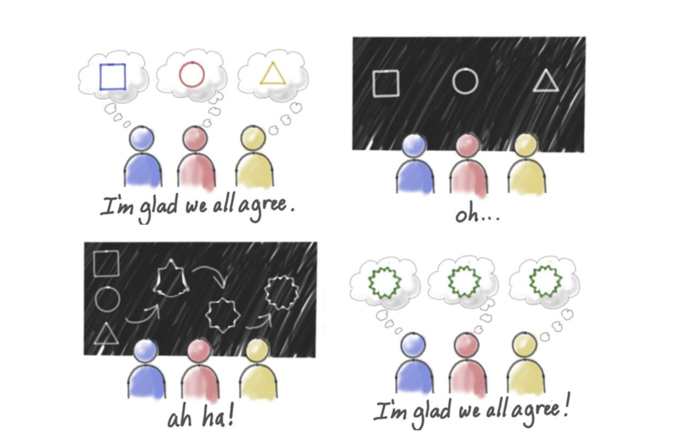
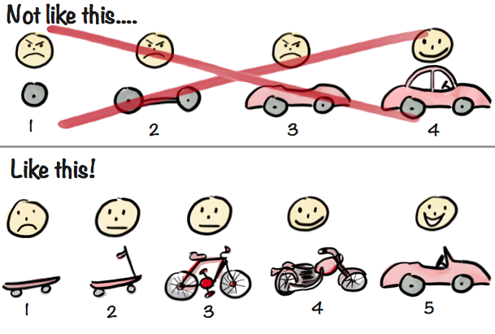

##What is a story map?
<h4 class="description">Gather requirements from a top down perspective.</h4>

Story mapping is a collaborative, top-down approach to gathering requirements in the early stages of product design/development. We create a map by starting with the overall user goals and product vision, working toward outlining an MVP and prioritizing additional features thereafter.

Remember, the backbone of the entire process is the story! It’s simply a list of steps or actions that your user makes during a specific timeframe.

####Why do we do it?
Story maps are a visual representation of the product we want to build. Creating these maps can help ensure the team has a big picture view of the scope and are on the same page about the features we are designing and building.

####How do I get started?

Story maps can be applied many ways, so you’ll need to decide whether you’re working out an MVP product, or focusing on defining a specific feature. At minimum, you’ll need 3 different colors of stickies:

- one color to represent the backbone: User Activities
- one color for the skeleton: User Tasks
- one color for details: Users Stories

Choose a timeframe you’re working in. A day, an entire journey, a specific event, etc.

Step 1: Write out your high level goals on post-its, starting from the left and working right across time

Step 2: Write out each activity a user needs to complete in order to achieve the goal, working from top to bottom in order of priority

Step 3: Write out tasks within each activity, working from top to bottom in order of priority

Step 4: Break down the tasks into smaller stories, and begin documenting alternatives

Step 5: Using painters tape, begin to slice your features into releases

Step 6: Move stories around to adjust according to priority

####After you finish:

Continue to capture additional alternatives, Assumptions, follow up questions. Having this on a wall allows you to review your board as a team during daily stand-ups and be sure to share your work with client stakeholders. Translate your story map into a digital format, using Trello, JIRA or Stories On Board.

  	 
