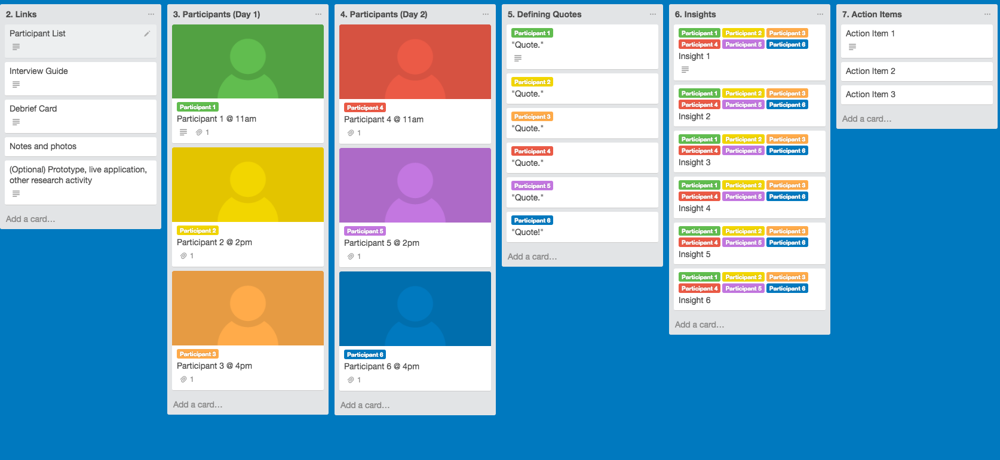

##What are user interviews?
<h4 class="description">Speak directly with users.</h4>

*Note: This method focuses on interviewing users, but can also be followed when interviewing stakeholders.*

Interviewing users is the process of speaking with a small subset of users. The interview itself is typically conducted in-person with a prepared set of open-ended questions that are written to help uncover information from the users that will help support or provide insights on a hypothesis. User interviews are useful for developing empathy and uncovering users’ existing mental models.

####Why do we do it?
We interview to help better understand our users, their needs, and pain points. By developing this level of understanding, we can also help guard against biases and false assumptions. Interviews can help provide context (like why users do things and how design solutions can address user needs) to user data, which often tells us what users do and when they do it. Speaking with users allows us to deeply understand what should form the basis of the design criteria and often uncovers opportunities for future improvements.

####How do I get started?

Coordinate with a project manager and begin recruiting participants as soon as possible; it will take longer than you think to schedule and confirm the sessions. You should also begin thinking about what kind of recording equipment you will need, and how the logistics of the test will work. Finally, make sure you have a clear idea of the objective(s) of the test. What specific hypotheses are you testing? What knowledge gaps are you trying to fill? Use who/what/when/where/why/how framing questions to get started (e.g. where will people be using my product?)

If you would like help managing your research, the User Interview Trello Board can be used to keep all of your planning, scheduling, and research findings in a single place.

Step 1: Write up a research plan that communicates the objective of the test, the hypotheses you are testing, where the test will take place, who will participate, and how you will be recording the interviews. (Optional: Use The User Research Trello Board to help you manage the interview process and record what you learn.)

Step 2: Write up the User Interview Script. Translate research objectives and hypotheses into open-ended questions you can ask your subjects.

Step 3: Recruit Interviewees (5-15). At Tigerspike, this is usually done by the client, but make sure you communicate which users you would like them to target. A good interview subject is someone who shares the concerns and goals of your target users, embodies key characteristics of your target users, can articulate their thoughts clearly, and shares target users’ familiarity with the relevant technology.

Step 4: Conduct Interviews.

Step 5: After each interview, take time to debrief and translate what you heard into actionable insights. Tigerspike has two tools for conducting these short debrief sessions: <a href="../tools/interview-debrief.html" title="Inteview Debrief">The Worksheet Debrief and The Post-It Debrief</a>. The Worksheet Debrief is a better option if you are looking to very quickly produce a summary of the interview that can be shared with the rest of the team and stakeholders. The Post-It Debrief is superior if you have more time to analyze the raw data later.

###After you finish:

Share information with your team about what you learned, and whether or not your hypotheses proved correct. If presenting findings to a client, the deck should include hypotheses and whether they tested to be relatively true or untrue, notable quotes, overarching themes, opportunities uncovered (unexpected findings), and next action steps.
