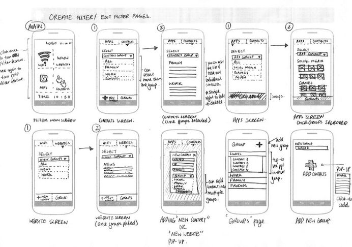
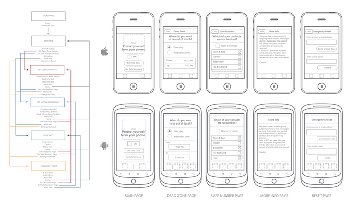
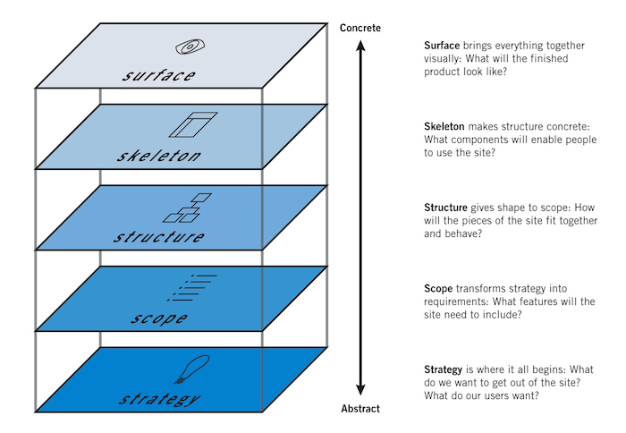

##What are wireframes?
<h4 class="description">Visually represent the structure, behavior, IA, content, and functionality of an interface.</h4>

Wireframes are visual representations of an interface, used to communicate the following details to get everyone on the same page:

  - <b>Structure</b>: How will the pieces be put together? What are the paths between pages or screens?
  - <b>Content</b>: What will be displayed? What general layout patterns will be used for creating consistency?
  - <b>Informational hierarchy</b>: How is this information organized and displayed? What is the highest priority?
  - <b>Functionality</b>: How will this interface work?
  - <b>Behavior</b>: How does it interact with the user? And how does it behave?

Often, the wireframes are accompanied by annotations that give more context about behaviors and interactions.

####Why do we it?

Wireframing allows you to plan the layout and interaction of an interface without being distracted by colors, typeface choices, or even copy. A wireframe's diagrams and annotations communicate the value and function of the design so that others can understand it. Wireframes can also allow developers to get a more tangible grasp of the app or website’s functionality by giving them a clear picture of the elements that they will need to code.

####How do I get started?

The strategy and scope of the project should be defined, and an understanding of the requirements is necessary in order to begin translating them into a wireframed interface.

 

 A wireframe document can be created using a whiteboard and dry-erase markers, paper and pencil, or software.

Wireframes should focus on the structure and skeleton of the design process, leaving the surface to be defined later in visual design exercises.

<b>Step 1: Structure.</b> Show user flows between views or pages. Typically, a combination of flowcharting, storyboarding and wireframing are used to achieve this.

<b>Step 2: Skeleton.</b> Focusing on layout, consider where design elements should be placed. Adding annotations to your document explains why and how each element is beneficial to the design.

Along with the diagrams and annotations, the final document could also include a cover page, table of contents, and a reference section.

####After you finish:

Your wireframe can be a living document and as the project moves forward, so does the need to add more diagrams and annotations. Typically, the final deliverable is a PDF. Wireframes could also be used to create a quick low-fidelity <a href="source/methods/prototypes.html" title="Prototypes">prototype</a> to show animation (transition between screens or a notification).
